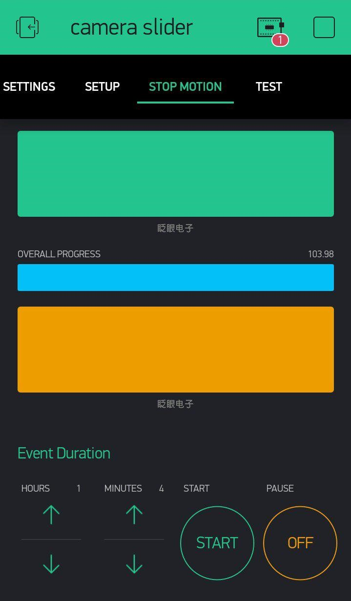
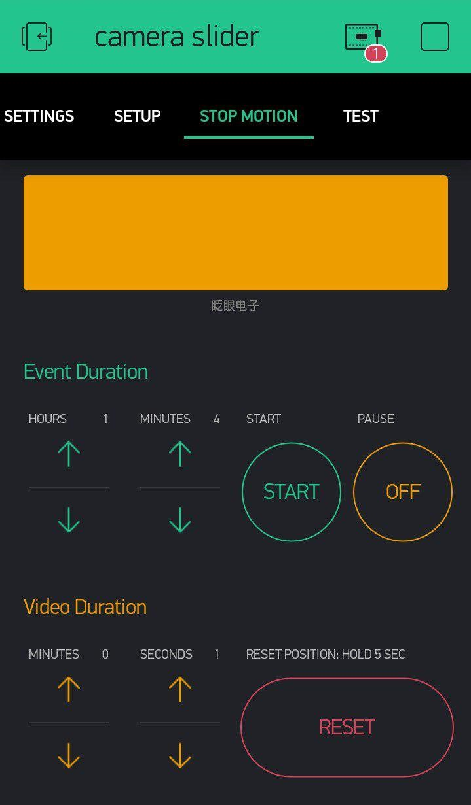

# Camera slider
This is an Arduino project for a camera slider for stop motion. 

| Settings tab | Setup tab | Stop Motion p1 | Stop Motion p2 |
| ---- | ---- | ---- | ---- |
|      |       |      |      |

**Warning:**
Project currently under development and not yet complete.

